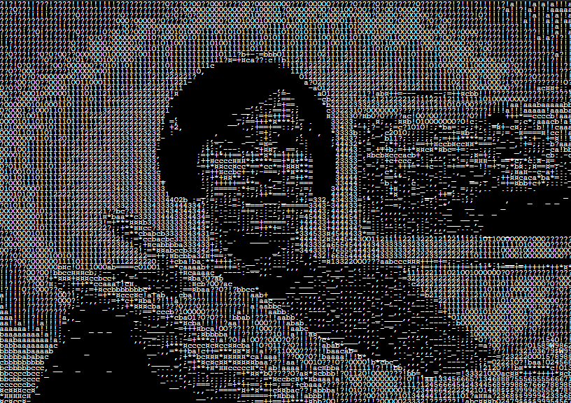

# Cam to ASCII

> Convert your webcam feed into ASCII art in real-time!

## Overview

The **Cam to ASCII** project captures video from your webcam and transforms it into ASCII art. This creative application showcases how to manipulate video frames using p5.js library, providing a unique way to visualize your surroundings.

## Features

- Real-time conversion of webcam video to ASCII art.
- Adjustable settings for ASCII character density.

## How It Works

- _Allow the browser to access your webcam when prompted._
- The project accesses the user's webcam.
- The pixel data is processed and mapped to ASCII characters based on brightness levels.
- The ASCII representation is then displayed on the screen in real-time.
- _Adjust the settings in script to change the character density or other parameters._

## Demo

## Source

This project is a tutorial from [The Coding Train](https://www.youtube.com/@TheCodingTrain) by Daniel Shiffman.
